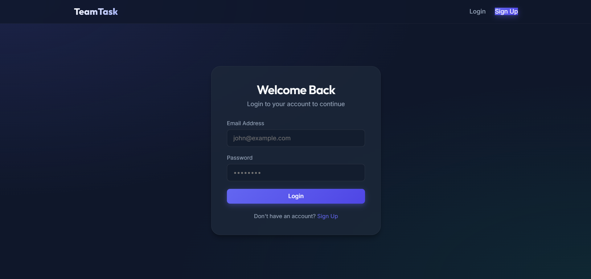
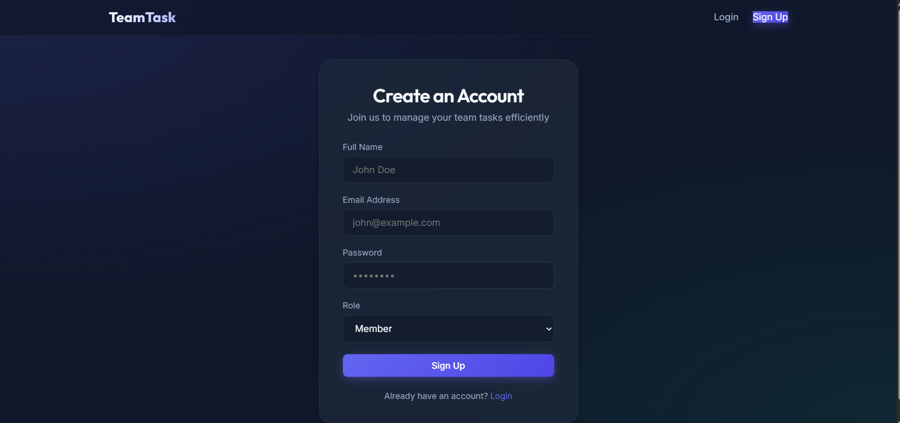
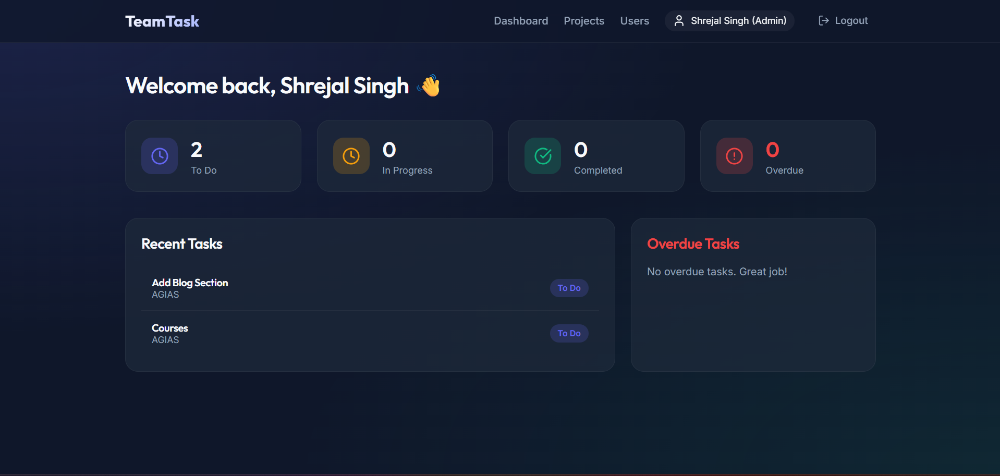
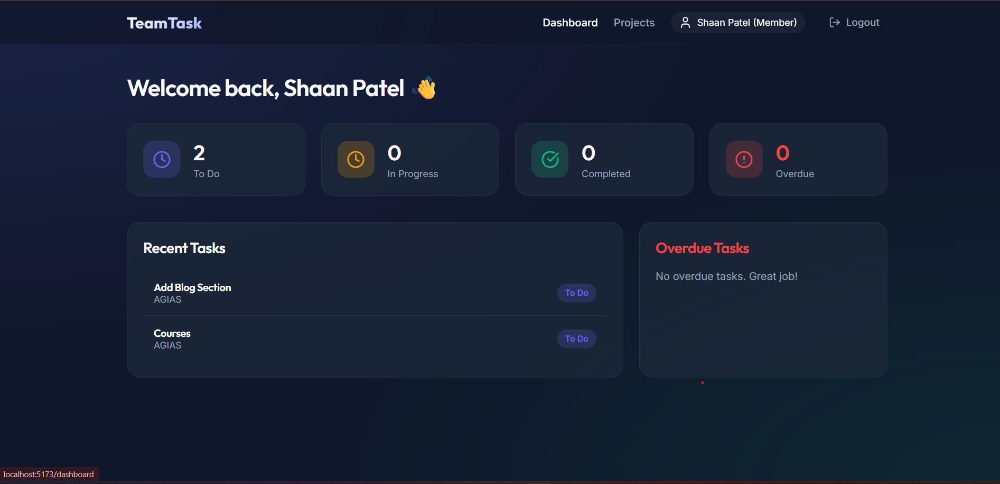
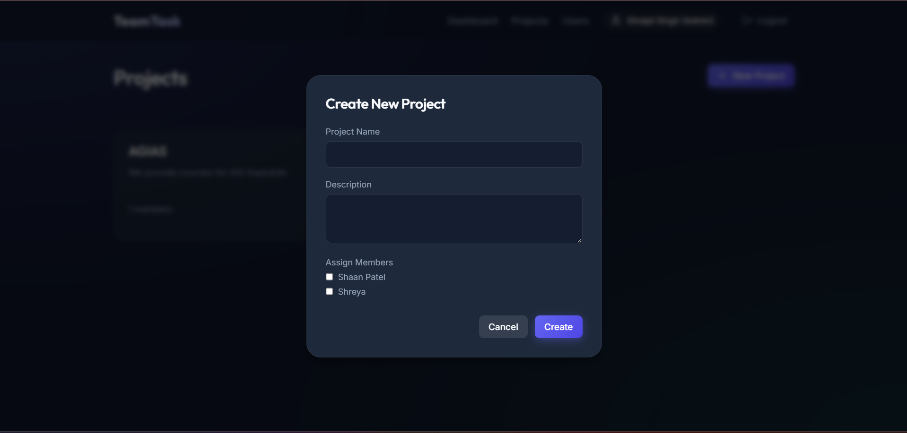
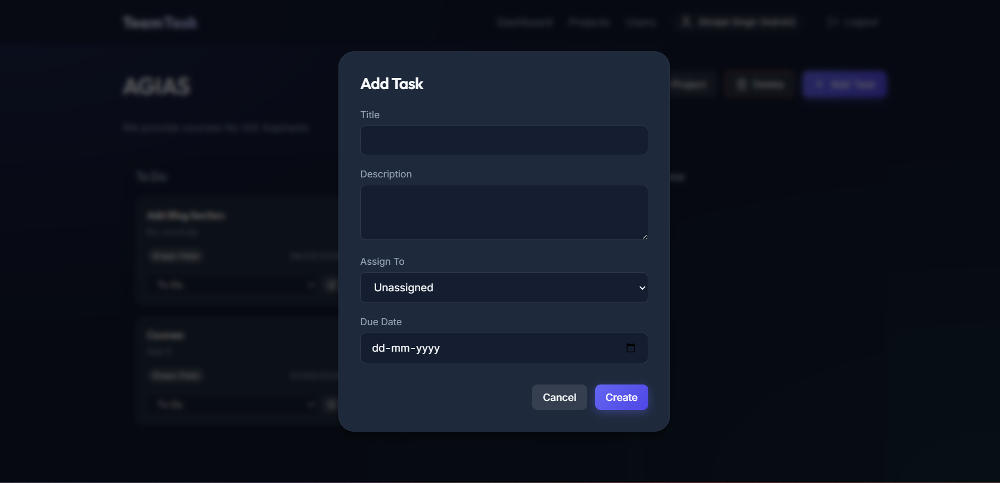

# Team Task Manager

Welcome to the Team Task Manager. This is a full-stack web application built using the MERN stack (MongoDB, Express, React, Node.js).

It is designed to help teams stay organized, manage projects, and track tasks without the clutter of heavy enterprise tools. Whether you are an Admin setting up a new project or a Member completing tasks on the Kanban board, this app keeps everything synced, secure, and easy to use.

## What is Inside?

- **Role-Based Access (RBAC)**:
  - **Admins** can create, edit, and delete projects, assign team members, and manage any task.
  - **Members** only see the projects they have been invited to and can update the status of their assigned tasks.
- **Kanban Board**: A clean, visual board (To Do, In Progress, Done) to easily track task status.
- **Project Management**: Simple project creation and member assignment.
- **Live Dashboard**: A quick glance at the workload, including a breakdown of tasks by status and an overview of overdue tasks.
- **Sleek UI**: A modern, glassmorphic design built with Vanilla CSS.

## Built With

- **Frontend:** React, React Router, Axios, Lucide React, and Vanilla CSS.
- **Backend:** Node.js and Express.
- **Database:** MongoDB Atlas with Mongoose.
- **Security:** JWT (JSON Web Tokens) for authentication and bcryptjs for password encryption.

## Getting Started

Follow these steps to run the project locally.

### Prerequisites
Ensure you have Node.js installed and a MongoDB Atlas account (or a local MongoDB instance).

### 1. Clone the Repo
```bash
git clone https://github.com/shrejal25/Team_Task_Manager-Ethara.AI.git
cd Team_Task_Manager-Ethara.AI
```

### 2. Configure the Backend
Navigate to the `backend` folder and install dependencies:
```bash
cd backend
npm install
```

Create a `.env` file in the `backend` directory and add your configuration:
```env
MONGO_URI=your_mongodb_connection_string
PORT=5000
JWT_SECRET=your_jwt_secret_key
```

Start the backend server:
```bash
npm run dev
```

### 3. Configure the Frontend
Navigate to the `frontend` folder and install dependencies:
```bash
cd ../frontend
npm install
```

Start the React development server:
```bash
npm run dev
```

The application will be available at `http://localhost:5173`.

## Screenshots

### Login Page


### Signup Page


### Admin Dashboard


### Member Dashboard


### Create Project


### Add Task


## Project Structure

```
Team_Task_Manager-Ethara.AI/
├── backend/                # Server-side code
│   ├── config/             # Database configuration
│   ├── controllers/        # Request handlers
│   ├── middleware/         # Auth and Role middleware
│   ├── models/             # Mongoose schemas
│   ├── routes/             # API routes
│   └── server.js           # Entry point
└── frontend/               # Client-side code
    ├── src/
    │   ├── components/     # Reusable components
    │   ├── context/        # State management
    │   ├── pages/          # Main views
    │   ├── services/       # API integration
    │   ├── App.jsx         # Routing
    │   └── index.css       # Styling
    └── package.json
```

## API Endpoints

### Authentication (/api/auth)
*   `POST /register` - Register a new user
*   `POST /login` - User login
*   `GET /users` - Get all users (Admin only)

### Projects (/api/projects)
*   `GET /` - List projects
*   `POST /` - Create a project (Admin only)
*   `GET /:id` - Get project details
*   `PUT /:id` - Update project (Admin only)
*   `DELETE /:id` - Delete project (Admin only)

### Tasks (/api/tasks)
*   `GET /` - List project tasks
*   `POST /` - Create task (Admin only)
*   `PUT /:id` - Update task status or details
